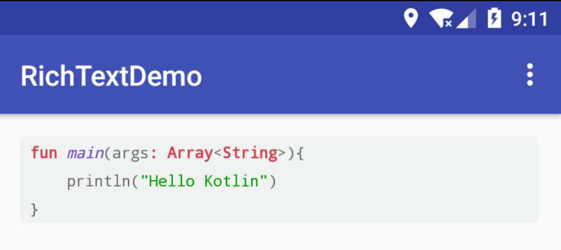

# RichText

> Android平台下的富文本解析器

### 修订说明 by Bennyhuo

本项目 Fork 自 [zzhoujay/RichText](https://github.com/zzhoujay/RichText)，基于原项目做了如下修改：

 1. 替换原生 Html 解析器为衍生自 [Pixplicity/HtmlCompat](https://github.com/Pixplicity/HtmlCompat) 的 Html 解析器，支持 `pre`、`code` 标签中保留空白字符（包括空格、换行等），并扩展了对些许 CSS 样式的支持。
 2. 调整 RichText 对 Html 文本中 `pre` 和 `code` 的渲染。

#### 示例：

 效果：

 

代码：

```java
RichText.from("<div class=\"highlight highlight-source-Kotlin\"><pre><code><span class=\"pl-k\">fun</span> <span class=\"pl-en\">main</span>(<span class=\"pl-smi\">args</span><span class=\"pl-k\">:</span> <span class=\"pl-k\">Array</span>&lt;<span class=\"pl-k\">String</span>&gt;){\n    println(<span class=\"pl-s\"><span class=\"pl-pds\">\"</span>Hello Kotlin<span class=\"pl-pds\">\"</span></span>)\n}</code></pre></div>")
    .into(textView);
```

```xml
<style name="pl_k">
    <item name="htmlForegroundColor">#d73a49</item>
    <item name="htmlFontStyle">bold</item>
</style>

<style name="pl_s">
    <item name="htmlForegroundColor">#00a000</item>
</style>

<style name="pl_en">
    <item name="htmlForegroundColor">#6f42c1</item>
    <item name="htmlFontStyle">italic</item>
</style>
```

---

* 流式操作
* 低侵入性
* 依赖少，只依赖了`disklrucache`和`support v4`
* 支持Html和Markdown格式文本
* 支持图片点击和长按事件
* 链接点击事件和长按事件
* 支持设置加载中和加载错误时的图片
* 支持自定义超链接的点击回调
* 支持修正图片宽高
* 支持GIF图片
* 支持Base64编码、本地图片和Assets目录图片
* 自持自定义图片加载器、图片加载器
* 支持内存和磁盘双缓存

### 效果


### gradle中引用的方法

```
compile 'com.zzhoujay.richtext:richtext:3.0.5'
```

### 关于issue

最近一段时间会比较忙，issue不能及时处理，一般会定时抽空集中解决issue，但时间有限解决速度上不敢保证。

欢迎提交pull request帮助完善这个项目

### 注意

在第一次调用RichText之前先调用`RichText.initCacheDir()`方法设置缓存目录

ImageFixCallback的回调方法不一定是在主线程回调，注意不要进行UI操作

本地图片由根路径`\`开头，Assets目录图片由`file:///android_asset/`开头

Gif图片播放不支持硬件加速，若要使用Gif图片请先关闭TextView的硬件加速

```java
textView.setLayerType(View.LAYER_TYPE_SOFTWARE, null);
```

### 使用方式

[多看wiki](https://github.com/zzhoujay/RichText/wiki)、[多看wiki](https://github.com/zzhoujay/RichText/wiki)、[多看wiki](https://github.com/zzhoujay/RichText/wiki)，重要的事情说三遍

### 后续计划

* ~~添加自定义标签的支持~~ (已添加对少部分自定义标签的支持)

### 关于Markdown

Markdown源于子项目：[Markdown](https://github.com/zzhoujay/Markdown)

若在markdown解析过程中发现什么问题可以在该项目中反馈

### 富文本编辑器

编辑功能目前正在开发中，[RichEditor](https://github.com/zzhoujay/RichEditor)

### 具体使用请查看demo

[ListView Demo](https://github.com/zzhoujay/RichText/blob/master/app/src/main/java/zhou/demo/ListViewActivity.java)、
[RecyclerView Demo](https://github.com/zzhoujay/RichText/blob/master/app/src/main/java/zhou/demo/RecyclerViewActivity.java)、
[Gif Demo](https://github.com/zzhoujay/RichText/blob/master/app/src/main/java/zhou/demo/GifActivity.java)


### License

```
The MIT License (MIT)

Copyright (c) 2016 zzhoujay

Permission is hereby granted, free of charge, to any person obtaining a copy
of this software and associated documentation files (the "Software"), to deal
in the Software without restriction, including without limitation the rights
to use, copy, modify, merge, publish, distribute, sublicense, and/or sell
copies of the Software, and to permit persons to whom the Software is
furnished to do so, subject to the following conditions:

The above copyright notice and this permission notice shall be included in all
copies or substantial portions of the Software.

THE SOFTWARE IS PROVIDED "AS IS", WITHOUT WARRANTY OF ANY KIND, EXPRESS OR

IMPLIED, INCLUDING BUT NOT LIMITED TO THE WARRANTIES OF MERCHANTABILITY,
FITNESS FOR A PARTICULAR PURPOSE AND NONINFRINGEMENT. IN NO EVENT SHALL THE
AUTHORS OR COPYRIGHT HOLDERS BE LIABLE FOR ANY CLAIM, DAMAGES OR OTHER
LIABILITY, WHETHER IN AN ACTION OF CONTRACT, TORT OR OTHERWISE, ARISING FROM,
OUT OF OR IN CONNECTION WITH THE SOFTWARE OR THE USE OR OTHER DEALINGS IN THE
SOFTWARE.
```

_by zzhoujay_


